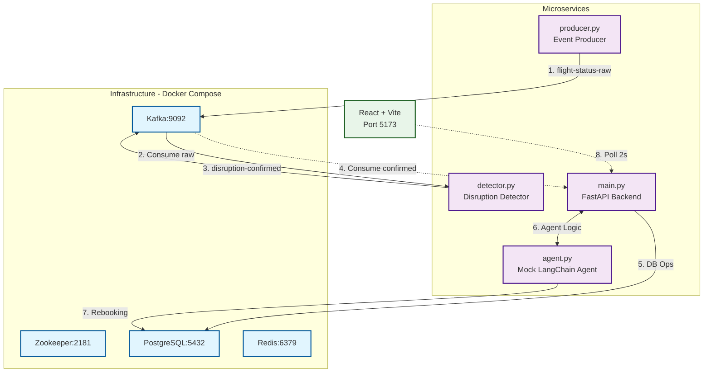
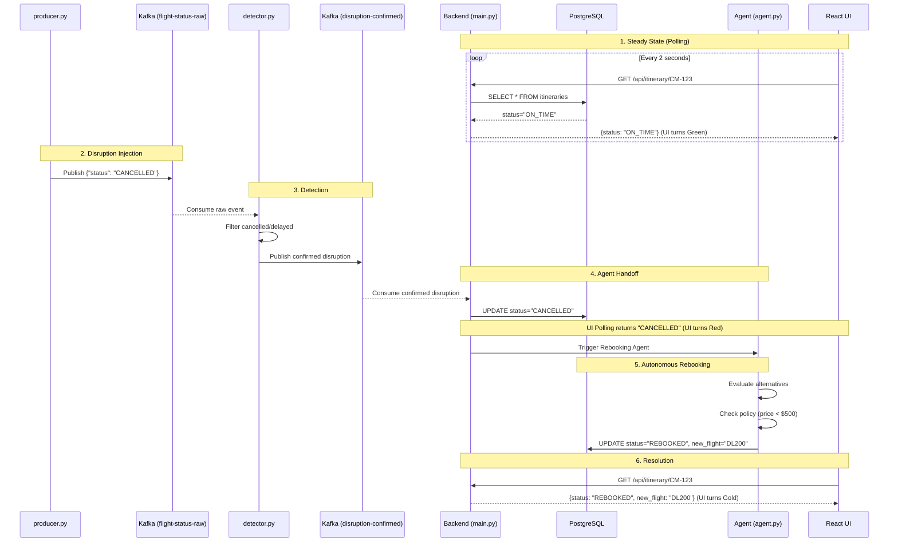

# AXIS Prototype
Autonomous Travel-Disruption Concierge prototype for CodeStreet 2026.

## 🏗️ System Architecture



## 🔄 Prototype Flow (What happens under the hood?)

When you run the prototype and trigger the disruption, the following event-driven sequence occurs in real-time (under 3 seconds):



1. **Steady State:** The React Frontend (Vite) continuously polls the FastAPI Backend. The PostgreSQL database shows flight `AX100` as `ON_TIME`. The UI is **Green**.
2. **Disruption Injection:** Running `make trigger` executes `producer.py`. It pushes a mock flight cancellation JSON payload to the Kafka topic `flight-status-raw`.
3. **Detection:** The `detector.py` service consumes the raw stream. It detects `status="CANCELLED"`, filters it, and publishes a confirmed event to the Kafka topic `disruption-confirmed`.
4. **Agent Handoff:** A background Kafka consumer in the FastAPI backend (`main.py`) catches the confirmed disruption. It updates the DB status to `CANCELLED` (changing the UI to **Red**) and instantly hands off to the LangChain mock agent (`agent.py`).
5. **Autonomous Rebooking:** The Agent executes a deterministic tool chain:
   - Evaluates alternative flights (`DL200` at $400, `UA300` at $600).
   - Checks the cardmember's policy rules (limit < $500).
   - Books `DL200`, updating the database itinerary to `REBOOKED`.
6. **Resolution:** The React UI fetches the updated state and transitions to **Gold**, notifying the user of the resolved flight without any manual intervention.

---

## 📁 Project Structure

```
axis-prototype/
├── docker-compose.yml          # Kafka, Zookeeper, PostgreSQL, Redis
├── Makefile                    # Unified commands (up, trigger, down)
├── start_all.sh / .ps1         # One-command startup (Linux/Windows)
├── trigger_disruption.sh / .ps1 # Trigger disruption event
├── services/
│   ├── event-producer/
│   │   ├── producer.py         # Mocks live flight data → Kafka
│   │   └── requirements.txt
│   ├── disruption-detector/
│   │   ├── detector.py         # Filters raw stream → confirmed disruptions
│   │   └── requirements.txt
│   └── backend-agent/
│       ├── main.py             # FastAPI + Kafka consumer + REST API
│       ├── agent.py            # Deterministic mock LangChain agent
│       ├── database.py         # PostgreSQL connection & schema
│       └── requirements.txt
└── frontend/
    ├── package.json
    ├── vite.config.js
    ├── tailwind.config.js
    └── src/
        ├── App.jsx             # Polls API, renders status card
        ├── main.jsx
        └── index.css
```

---

## 📚 Documentation
- [Solution Proposal](axis-prototype/docs/proposal-1-travel-disruption-concierge.md)

---

## How to Run (Codespaces / Linux / Mac)

The easiest way to run this project is via the provided `Makefile` inside the `axis-prototype` directory.

```bash
cd axis-prototype
```

1. **Start all services:**
   ```bash
   make up
   ```
   *(Wait for Docker, Backend, Detector, and Frontend to boot. The UI will be available at `http://localhost:5173`)*

2. **Trigger a disruption:**
   Open a second terminal and run:
   ```bash
   make trigger
   ```
   *(Watch the React UI automatically update!)*

3. **Stop services:**
   Press `Ctrl+C` in the first terminal, then run:
   ```bash
   make down
   ```

### ⚠️ Important Note for GitHub Codespaces Users
If you are running this in GitHub Codespaces, the React frontend needs to communicate with the FastAPI backend.
By default, Codespaces makes backend ports private. **You must make Port 8000 Public.**
1. Look at the bottom panel in Codespaces and click the **Ports** tab.
2. Right-click on Port **8000** -> Port Visibility -> **Public**.
3. Now open the React UI (Port 5173).

---

## How to Run (Windows)

If you are on Windows, ensure Docker Desktop is running, then use the provided PowerShell scripts inside the `axis-prototype` directory:

```powershell
cd axis-prototype
```

1. **Start all services:**
   Open a PowerShell window as Administrator and run:
   ```powershell
   .\start_all.ps1
   ```
2. **Trigger a disruption:**
   ```powershell
   .\trigger_disruption.ps1
   ```
