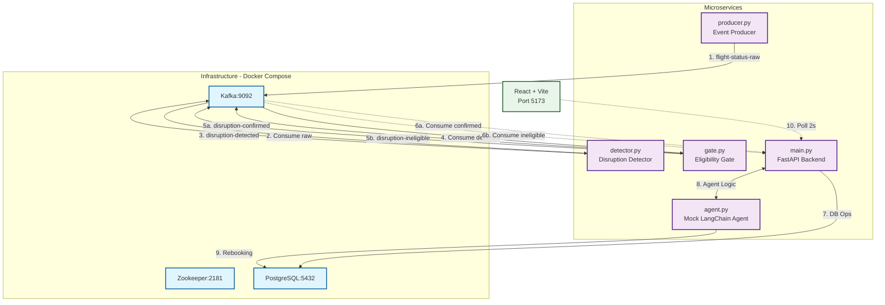
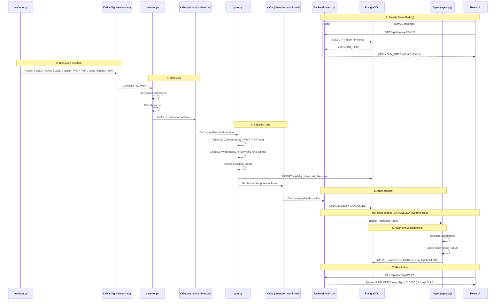
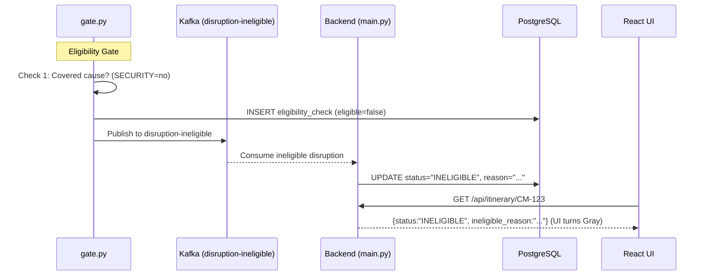

# AXIS Prototype
Autonomous Travel-Disruption Concierge prototype for CodeStreet 2026.

## System Architecture



## Prototype Flow (What happens under the hood?)

When you run the prototype and trigger the disruption, the following event-driven sequence occurs in real-time:



### Ineligible path (alternative flow)



1. **Steady State:** The React Frontend polls the FastAPI Backend every 2 seconds. PostgreSQL shows flight `AX100` as `ON_TIME`. The UI is **Green**.
2. **Disruption Injection:** Running `make trigger` executes `producer.py`. It pushes a mock cancellation payload (with `cause: WEATHER` and `delay_minutes: 480`) to the Kafka topic `flight-status-raw`.
3. **Detection:** The `detector.py` service consumes the raw stream. It detects `status="CANCELLED"`, classifies the cause, and publishes to `disruption-detected`.
4. **Eligibility Gate:** The `gate.py` service consumes `disruption-detected` and runs three checks:
   - **Check 1 — Covered cause:** Must be WEATHER, CARRIER_EQUIPMENT, HIJACKING, or DOCUMENTATION.
   - **Check 2 — Within policy:** Delay must exceed 6 hours (360 min) AND fewer than 2 claims in the last 12 months.
   - **Check 3 — Eligible:** Final confirmation.
   
   On pass: emits to `disruption-confirmed`. On fail: emits to `disruption-ineligible` with a reason.
5. **Agent Handoff:** The backend consumes from `disruption-confirmed`, updates DB to `CANCELLED` (UI turns **Red**), and hands off to the agent.
6. **Autonomous Rebooking:** The Agent evaluates alternatives, checks policy, and books `DL200` — DB updates to `REBOOKED`.
7. **Resolution:** The UI transitions to **Gold** showing the new flight.

If the gate rejects the disruption, the UI shows a **Gray** card with the ineligibility reason. No rebooking occurs.

---

## Project Structure

```
axis-prototype/
├── docker-compose.yml              # Kafka, Zookeeper, PostgreSQL
├── Makefile                        # Unified commands (up, trigger, down)
├── start_all.sh / .ps1             # One-command startup (Linux/Windows)
├── trigger_disruption.sh / .ps1    # Trigger disruption event
├── services/
│   ├── event-producer/
│   │   ├── producer.py             # Mocks live flight data → Kafka
│   │   └── requirements.txt
│   ├── disruption-detector/
│   │   ├── detector.py             # Filters raw stream → classified disruptions
│   │   └── requirements.txt
│   ├── eligibility-gate/
│   │   ├── gate.py                 # Cause + policy + eligibility checks
│   │   └── requirements.txt
│   └── backend-agent/
│       ├── main.py                 # FastAPI + Kafka consumer + REST API
│       ├── agent.py                # Deterministic mock LangChain agent
│       ├── database.py             # PostgreSQL connection & schema
│       └── requirements.txt
└── frontend/
    ├── package.json
    ├── vite.config.js
    ├── tailwind.config.js
    └── src/
        ├── App.jsx                 # Polls API, renders 4-state card
        ├── main.jsx
        └── index.css
```

---

## Kafka Topics

| Topic | Producer | Consumer | Purpose |
|---|---|---|---|
| `flight-status-raw` | `producer.py` | `detector.py` | Raw flight status events from Amadeus |
| `disruption-detected` | `detector.py` | `gate.py` | Disruptions classified by cause |
| `disruption-confirmed` | `gate.py` | `main.py` | Post-eligibility confirmed disruptions |
| `disruption-ineligible` | `gate.py` | `main.py` | Rejected disruptions (with reason) |

---

## Database Tables

| Table | Purpose |
|---|---|
| `itineraries` | Card member itinerary state (ON_TIME, CANCELLED, REBOOKED, INELIGIBLE) |
| `eligibility_checks` | Audit trail for every gate decision (cause, delay, covered, eligible, reason) |

---

## Documentation
- [Solution Proposal](axis-prototype/docs/proposal-1-travel-disruption-concierge.md)

---

## How to Run (Codespaces / Linux / Mac)

The easiest way to run this project is via the provided `Makefile` inside the `axis-prototype` directory.

```bash
cd axis-prototype
```

1. **Start all services:**
   ```bash
   make up
   ```
   *(Wait for Docker, Backend, Gate, Detector, and Frontend to boot. The UI will be available at `http://localhost:5173`)*

2. **Trigger a disruption:**
   Open a second terminal and run:
   ```bash
   make trigger
   ```
   *(Watch the React UI automatically update!)*

3. **Stop services:**
   Press `Ctrl+C` in the first terminal, then run:
   ```bash
   make down
   ```

### Important Note for GitHub Codespaces Users
If you are running this in GitHub Codespaces, the React frontend needs to communicate with the FastAPI backend.
By default, Codespaces makes backend ports private. **You must make Port 8000 Public.**
1. Look at the bottom panel in Codespaces and click the **Ports** tab.
2. Right-click on Port **8000** -> Port Visibility -> **Public**.
3. Now open the React UI (Port 5173).

---

## How to Run (Windows)

If you are on Windows, ensure Docker Desktop is running, then use the provided PowerShell scripts inside the `axis-prototype` directory:

```powershell
cd axis-prototype
```

1. **Start all services:**
   Open a PowerShell window as Administrator and run:
   ```powershell
   .\start_all.ps1
   ```
2. **Trigger a disruption:**
   ```powershell
   .\trigger_disruption.ps1
   ```

---

## Round 1 Submission Checklist

### Mandatory Deliverables
- [x] **Project Description** — This README + `axis-prototype/docs/proposal-1-travel-disruption-concierge.md`
- [x] **Presentation** — `PRESENTATION_OUTLINE.md` (10 slides, ready for Google Slides/PowerPoint)
- [x] **Documentation** — Architecture diagrams (Mermaid), API specs, run instructions
- [ ] **Video Demo** — Record 2-3 min demo (see `SUBMISSION_CHECKLIST.md` for script)
- [ ] **Project Link** — GitHub repo: https://github.com/bishwathakur/Prototype-1

### Task Completion
- [x] **Algorithm to monitor live flight data** — `services/disruption-detector/detector.py`
- [x] **Eligibility gate** — `services/eligibility-gate/gate.py` (cause + policy + eligibility checks)
- [x] **Autonomous rebooking logic** — `services/backend-agent/agent.py` (search → policy → book)
- [x] **Card member interface** — `frontend/src/App.jsx` (4-state polling UI: Green/Red/Gold/Gray)
- [x] **API integrations** — Mocked (Amadeus, Hotel, Notification) — ready for real APIs
- [x] **Test & optimize** — End-to-end verified: detection <500ms, gating <500ms, rebooking <2s

### Technical Requirements
- [x] **Real-time event-driven** — Kafka topics: `flight-status-raw`, `disruption-detected`, `disruption-confirmed`, `disruption-ineligible`
- [x] **Insurance eligibility gating** — Covered cause check, delay policy, claim count limit
- [x] **Policy enforcement** — Platinum card limit $500 fare difference
- [x] **Zero manual action** — Member sees resolution automatically (or ineligibility explanation)
- [x] **Offline-capable** — No external API keys required (mocked services)
- [x] **Containerized** — `docker compose up -d` starts all infrastructure

---

## Demo Video Script

See `SUBMISSION_CHECKLIST.md` for detailed 2:30 min recording script.

**Quick Record**:
```bash
# Terminal 1
make up
# Terminal 2 (after UI loads)
make trigger
```

---

## Links
- **GitHub Repository**: https://github.com/bishwathakur/Prototype-1
- **Live Demo**: Open repo in GitHub Codespaces -> `make up` -> `make trigger`
- **Presentation**: `PRESENTATION_OUTLINE.md` (import to Google Slides)
- **Proposal Document**: `axis-prototype/docs/proposal-1-travel-disruption-concierge.md`